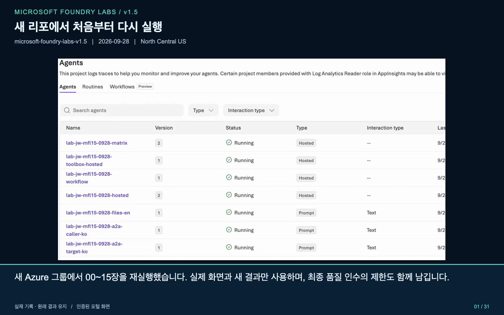

# Microsoft Foundry 실습 가이드 · v1.3

[English](README.md) | **한국어**

내 Azure 구독에서 **출장 규정 도우미**를 만듭니다. 문서 검색과 도구를 연결하고, 답변을 평가한 뒤 배포합니다. 코드와 실습용 가상 데이터는 모두 포함되어 있습니다.

2025년 11월 Microsoft Ignite 2025 직후에 만든 [microsoft-foundry-labs](https://github.com/junwoojeong100/microsoft-foundry-labs)의 후속 버전입니다. 이전 버전은 필요하지 않습니다.

| 지금 할 일 | 바로 가기 |
|---|---|
| 처음 시작 | **[00. 실습 준비](docs/00-setup.md)** |
| 이전 실습 이어 하기 | [재개 순서](docs/checkpoints.md#다음-날-재개하기) |
| 오류 해결 | [문제 해결](docs/troubleshooting.md) |
| 오늘 실습 종료 | **[실행 중지·비용 확인](docs/15-capstone-cleanup.md#4-먼저-실행-중인-것을-멈추기)** |

**준비물:** Microsoft Entra ID 계정, Azure 구독, 활성 구독 Owner 역할, 도구를 설치할 수 있는 PC.

ZIP으로 시작하면 Git 설치와 GitHub 계정은 필요하지 않습니다. GitHub 자동 배포를 다루는 14장만 예외입니다.

> [!WARNING]
> **유료 실습입니다.** 모델 호출, 검색 서비스, 파일 저장, 배포 실행에 비용이 발생할 수 있습니다. 터미널이나 브라우저를 닫아도 Azure 자원은 남습니다.

## 처음 시작하는 순서

1. [00. 실습 준비](docs/00-setup.md)에서 파일·도구·Azure 설정을 준비합니다.
2. [01. 첫 응답](docs/01-foundry.md)부터 순서대로 진행합니다. 명령 하나를 실행한 뒤 바로 아래의 **확인**과 결과를 대조합니다.
3. 중간에 멈추더라도 [15. 중지·정리](docs/15-capstone-cleanup.md#4-먼저-실행-중인-것을-멈추기)를 수행합니다.

**처음에는 한국어 기본 경로만 따라가세요.** `선택` 절과 접힌 설명은 해당할 때만 읽습니다. 과거 검증 보고서를 재현할 필요는 없습니다.

| 안내 | 실행 방법 |
|---|---|
| **시작 조건** | 필요한 앞 단계가 끝났는지 확인합니다. |
| **실행 위치** | 포털·터미널·편집기 중 지정한 곳에서 작업합니다. |
| **진행 지도** | 단계 이름을 누르면 해당 절로 이동합니다. |
| **명령 상자** | 상자 전체를 복사합니다. 긴 명령도 직접 줄을 나누지 않습니다. |
| **확인 / 완료 확인** | 실제 출력과 대조합니다. 오류가 있으면 의존하는 다음 명령은 멈춥니다. |

자리표시자와 결과 파일이 낯설면 [명령·결과 읽기](docs/checkpoints.md)를 먼저 읽으세요. 별도 제출 파일은 없습니다.

## 무엇을 만드나요?

가상 기업 **한빛기술의 출장 규정 도우미**입니다.

> “2026년 9월 국내 출장 호텔이 1박 170,000원인데 예약해도 되나요?”

기대 답변은 **한도 150,000원, 예약 전 팀장 승인 필요, 근거 문서**입니다. 자료가 없으면 확인을 요청하고, 실제 승인이나 결제를 수행했다고 말하지 않아야 합니다.

Microsoft Foundry는 이 도우미의 **모델·문서·도구·평가·배포를 연결하는 Azure 플랫폼**입니다.


## 진행 순서

처음에는 기본 답변 모델 하나만 배포합니다. 나머지 서비스와 모델은 필요한 장에서 준비합니다.

| 장 | 할 일 | 확인할 결과 |
|---|---|---|
| [00 준비](docs/00-setup.md) | 개발 환경·프로젝트·권한 준비 | 로컬 검사 통과, 실제 연결 설정 |
| [01 첫 응답](docs/01-foundry.md) | 포털과 코드에서 모델 호출 | 답변과 응답 ID |
| [02 모델·지침](docs/02-models-prompts.md) | 질문과 지침 비교 | 답변 차이. Luna·Router 비교는 선택 |
| [03 에이전트·파일](docs/03-knowledge.md) | Prompt Agent·File Search 생성 | 저장 버전, 검색 호출, 파일 인용 |
| [04 도구](docs/04-tools.md) | 함수·MCP·Code Interpreter 실행 | 실제 도구 입력·결과·파일 |
| [05 워크플로](docs/05-workflows.md) | 순차·병렬·대화·중단/재개 | 실행 방식별 출력과 상태 |
| [06 검색](docs/06-search-iq.md) | Search·IQ·Hybrid 구성 | 반환된 원문과 인용 |
| [07 평가](docs/07-evaluation.md) | 같은 질문으로 지침 비교 | 6문항의 업무 검사와 평가 점수 |
| [08 배포](docs/08-hosted.md) | 로컬 확인 후 Hosted 배포 | 정확한 원격 버전의 답변 |
| [09 운영](docs/09-operations.md) | 로그·Insights·비용 확인 | 실제 요청의 추적 기록 |
| [10 공유 도구](docs/10-toolbox-skills.md) | Toolbox·Skill·OpenAPI 연결 | 버전별 실제 도구 사용 |
| [11 기억·위임·예약](docs/11-memory-a2a-routines.md) | Memory·A2A·Routine 실행 | 저장·위임·예약 결과, 예약 중지 |
| [12 품질 개선](docs/12-improvement.md) | 대화·Optimizer·배포 평가 | 같은 조건의 배포 전후 비교 |
| [13 실습 안전](docs/13-governance.md) | 보호 정책·관리형 AI red teaming 확인 | 실제 개입과 판정의 일관성 |
| [14 CI/CD](docs/14-additional-permissions.md) | GitHub OIDC 자동 배포 | 배포 버전과 dev 검사. 권한 필요 |
| [15 마무리](docs/15-capstone-cleanup.md) | 조건 충족 시 최종 평가, 자원 정리 | 품질 판정과 남은 비용 |

모든 구독에서 모든 기능을 실행할 수 있는 것은 아닙니다. 미지원 기능은 **차단**으로 남기고, [그 기능에 의존하지 않는 단계](docs/checkpoints.md#막힌-단계가-있을-때)만 이어갑니다.

### 모델 이름은 역할별로 구분합니다

| 역할 | 기반 모델 | 새 환경의 배포 이름 |
|---|---|---|
| 기본 답변 | GPT-6 Sol | `workshop-chat` |
| 선택 비교 | GPT-6 Luna | `workshop-compare` |
| 답변 평가 | GPT-5.5 | `workshop-judge` |

평가 모델(judge)은 답변 모델과 **기반 모델·배포를 모두 분리**합니다. 기존 배포를 바꾸거나 삭제하지 마세요. [전체 모델·버전·기존 이름 사용법](docs/model-selection.md).

## 설정과 결과 찾기

| 위치 | 내용 |
|---|---|
| `.venv/` | 이 실습의 Python 환경 |
| `.env`, `.selfstudy/` | 내 Azure 설정과 배포 준비 정보. 공개하지 않음 |
| `outputs/` | 답변·평가·생성한 자원의 소유 기록 |

**00장의 설정을 마친 뒤에만** 다음 명령을 사용합니다. 새 터미널에서는 먼저 [가상 환경을 활성화](docs/checkpoints.md#다음-날-재개하기)하세요. 모든 명령은 README가 있는 폴더에서 실행합니다.

**로컬 데이터와 Python 확인**

```bash
python scripts/workshop.py doctor
```

**저장된 Azure 설정 확인**

```bash
python scripts/selfstudy.py values
```

두 명령은 모델을 호출하지 않습니다. `values`는 Azure 자원의 현재 상태도 조회하지 않습니다.

## 검증 상태와 한계

> [!IMPORTANT]
> **2026-09-28 검증은 최종 인수 보류이며, 새 holdout은 미실행입니다.**

SDK·Hosted dev는 각각 6/6이지만, 관리형 Task Adherence는 6행 중 5 pass/1 fail이며 점수 방향과 판정 값이 불일치합니다. Optimizer도 새 전체 후보를 만들지 않았습니다.

[검증 보고서](docs/validation-report.md)는 참고 기록이며 본인의 완료 결과가 아닙니다. 실패·빈 응답을 예시 답변으로 대체하거나, 일부 성공을 전체 통과로 해석하지 않습니다.

<a id="포털cli-요약-영상"></a>

## 포털·CLI 요약 영상

각 **4분 32초**, 음성 없이 자막을 제공합니다. 전체 절차는 위의 문서를 따라가세요.

| 한국어 | English |
|---|---|
| [](docs/assets/videos/foundry-v1.3-summary-ko.mp4) | [](docs/assets/videos/foundry-v1.3-summary-en.mp4) |
| [MP4](docs/assets/videos/foundry-v1.3-summary-ko.mp4) · [자막](docs/assets/videos/foundry-v1.3-summary-ko.srt) | [MP4](docs/assets/videos/foundry-v1.3-summary-en.mp4) · [Captions](docs/assets/videos/foundry-v1.3-summary-en.srt) |

North Central US의 실제 포털·CLI 재실행을 요약했습니다. 한·영 자막은 전체 실습을 두 언어로 각각 실행했다는 뜻이 아닙니다. [녹화 범위·이전 영상](docs/videos.md).

**도움말:** [진행·재개](docs/checkpoints.md) · [문제 해결](docs/troubleshooting.md) · [기능 찾기](docs/feature-map.md) · [코드 읽기](docs/code-reading.md) · [공식 자료](docs/sources.md)
