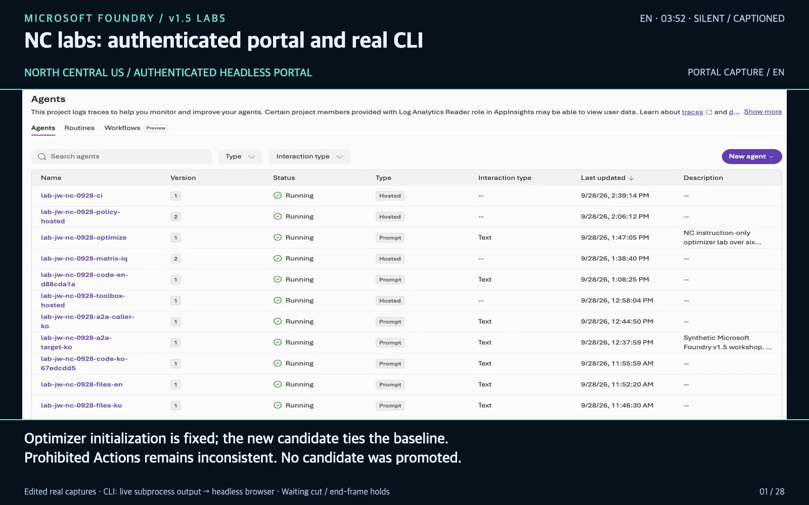
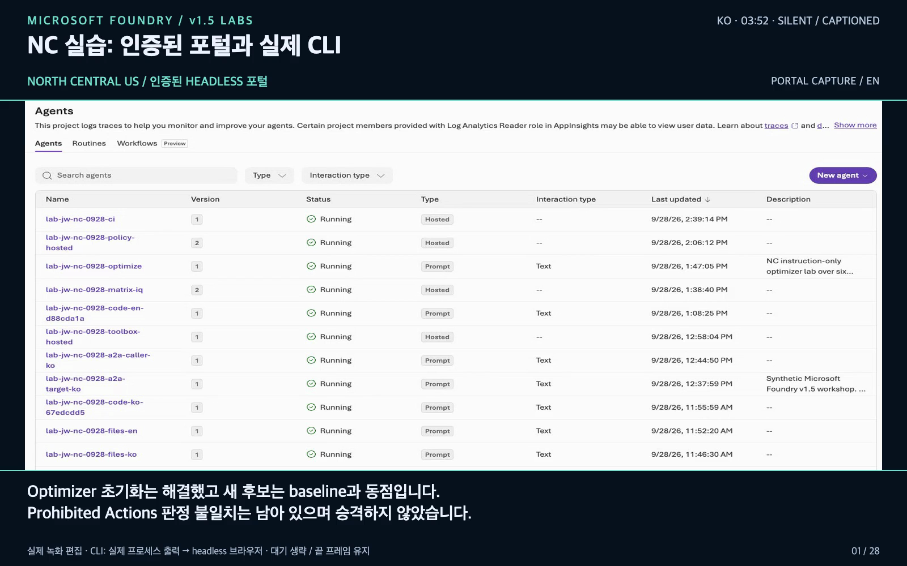

# Microsoft Foundry Hands-on Guide · v1.5

**English** | [한국어](README.ko.md)

**Build an AI assistant in your own Azure environment, connect evidence and tools, evaluate it, and deploy it. All workshop code and synthetic data are included.**

You need a **Microsoft Entra ID account, an Azure subscription, and an active subscription Owner role**. Work at your own pace; there is no course time limit. A workshop ZIP does not require a GitHub account or Git.

**Start here → [00. Set up your environment](docs/en/00-setup.md)**

Already started? → [Your workbook](worksheets/en/workbook.md)

**Current region: North Central US (`northcentralus`).** Korean/English Search, IQ, Hybrid, IQ Chat, Hosted IQ v1/v2 dev 6/6, and an actual scheduled response are verified. **A new Task Adherence-only managed job passed 5/5 with consistent native flags.** The earlier mixed job still retains five pass/one fail and the Prohibited Actions inconsistency. This is not an all-ASR fix or production safety certification. Read the [results and remaining limits](docs/en/validation-report.md) and keep the [fresh-workspace/archive boundary](docs/en/00-setup.md#start-a-new-project-without-adopting-old-state).

The primary red-team target is the **managed AI red-teaming service** in chapter 13. The custom eight-case policy diagnostic is complementary, not a replacement or evidence that managed red teaming works.

**The follow-up resolved Optimizer's missing required initialization.** A new job retained the original evaluator versions and threshold 4; baseline and candidate each passed all six rows and their source-reference audits. Both scored 1.0; neither improvement nor promotion is claimed. Prohibited Actions remained inconsistent in a separate pinned-v5 run.

North Central US appears in **both official regional sources**, although their wider lists currently conflict. [Chapter 13 records that discrepancy](docs/en/13-governance.md#5-managed-ai-red-teaming--the-primary-verification-target). Do not infer that Sweden caused the old ASR problem or that changing regions fixes metric direction.

## What will you build?

A travel-policy assistant for the fictional company **Hanbit Technology**.

> “A hotel for my domestic business trip in September 2026 costs KRW 170,000 per night. May I book it?”

The intended answer explains the **KRW 150,000 limit, team-lead approval required before booking, and supporting documents**. Without evidence, the assistant must not guess or claim to approve, book, or pay.

Foundry connects **models, agents, knowledge, tools, evaluation, and operations** in one Azure platform. You will explore that lifecycle through the same synthetic business case.

Start directly with **GPT-6 Sol**. **GPT-6 Luna is an optional comparison**, and **GPT-5.5 is the judge**, using a different base model and a separate target/judge deployment. Fresh deployments use `workshop-chat`, `workshop-compare`, and `workshop-judge` respectively. Existing aliases may differ: never replace the model behind an existing name or delete it to match these examples. See [Model roles and existing aliases](docs/en/model-selection.md).


The shared diagram shows local CLI/MAF code calling Foundry models and agents, retrieving six synthetic policies through File Search/Search/IQ, and using evaluation, traces, and human review to improve instructions.

## Curriculum

| Step | What you do | Evidence you keep |
|---|---|---|
| [00 Setup](docs/en/00-setup.md) | Prepare tools, a project, a model, and permissions | Your environment |
| [01 First response](docs/en/01-foundry.md) | Call a model in the portal and from code | An actual response |
| [02 Models and prompts](docs/en/02-models-prompts.md) | Compare instructions; optionally compare Luna and Router | A reasoned selection |
| [03 Agents and files](docs/en/03-knowledge.md) | Create a Prompt Agent and use File Search | Exact versions and citations |
| [04 Tools](docs/en/04-tools.md) | Run functions, MCP, and Code Interpreter | Actual tool results |
| [05 Workflows](docs/en/05-workflows.md) | Run sequential, parallel, chat, and pause/resume flows | Execution records |
| [06 Retrieval](docs/en/06-search-iq.md) | Configure Search, IQ, and Hybrid | Retrieved source documents |
| [07 Evaluation](docs/en/07-evaluation.md) | Compare the same questions before and after changes | Quality evidence |
| [08 Deployment](docs/en/08-hosted.md) | Test locally, then deploy a Hosted Agent | A remote version and response |
| [09 Operations](docs/en/09-operations.md) | Inspect traces, Insights, and costs | Request-level observations |
| [10 Shared tools](docs/en/10-toolbox-skills.md) | Connect Toolbox, Skills, and OpenAPI | Reusable, versioned tools |
| [11 State and scheduling](docs/en/11-memory-a2a-routines.md) | Use Memory, A2A, and Routines | State and dispatch records |
| [12 Improvement](docs/en/12-improvement.md) | Evaluate conversations, optimization, and deployed versions | Reviewed candidates |
| [13 Lab safety](docs/en/13-governance.md) | Verify managed AI red teaming, lab guardrails, identities, and inventory | Native run evidence and limitations |
| [14 GitHub OIDC CI/CD](docs/en/14-additional-permissions.md) | Run the included identity-based lab release workflow | Exact version and smoke/dev evidence |
| [15 Acceptance and cleanup](docs/en/15-capstone-cleanup.md) | Verify the final target and stop, retain, or remove resources | Results and lifecycle records |

Follow each chapter's **run → verify → next** sequence. No second repository or separate learning path is required.

## Run in English

Run all commands from **the folder containing this README**, after the setup in chapter 00.

```bash
python scripts/workshop.py --language en doctor
python scripts/selfstudy.py values
```

`--language en` selects the bundled English prompts, policies, and cases. It goes **before the workshop subcommand**; wrapper options such as `--model-deployment` and `--script` go before it. `selfstudy.py` has no global language flag, but its `prepare-hosted` and `capture` subcommands require their own `--language en` for English work. See [Data and localization](docs/en/data-format.md).

Keep `.venv/` for Python, `.env` for private Azure configuration, and `outputs/` for real results and ownership records. English examples use separate labels and `outputs/learner-notes-en/`.

## Ground rules

- Use only the six synthetic policies in `data/knowledge/en/policies.json`; no real company data, secrets, tokens, bookings, payments, or approvals.
- Create services only when needed. Owner does not guarantee quota, regional availability, or preview access; keep organizational protections in place.
- Never replace errors or empty responses with fixtures, or treat one good answer as evidence that the whole lab passed.
- **Even when stopping early, follow [chapter 15](docs/en/15-capstone-cleanup.md).** In retention mode, keep resources and ownership records, disable routines, and stop compute without deleting agents or volumes.

<a id="portal-and-cli-summary-videos"></a>

## North Central US portal and CLI summary videos

**NC edition: 3:52 each, silent with captions.** Eight fresh **authenticated Playwright Headless portal scenes** accompany preserved real CLI captures. The original Optimizer failure, successful fix, tied baseline/candidate, and unresolved Prohibited Actions inconsistency remain distinct. Login screens and credentials are excluded from the edit; the temporary login profile was removed.

| English | 한국어 |
|---|---|
| [](docs/assets/videos/foundry-v1.5-summary-en.mp4) | [](docs/assets/videos/foundry-v1.5-summary-ko.mp4) |
| [Watch MP4](docs/assets/videos/foundry-v1.5-summary-en.mp4) · [Captions](docs/assets/videos/foundry-v1.5-summary-en.srt) | [MP4 보기](docs/assets/videos/foundry-v1.5-summary-ko.mp4) · [자막](docs/assets/videos/foundry-v1.5-summary-ko.srt) |

[Recording scope and provenance](docs/en/videos.md) · [Live validation findings](docs/en/validation-report.md). These links now show the **NC portal and CLI edition**. The prior NC CLI edit remains in revision `1d53a68`, and Sweden footage in `0a8ab50`; original results and scores were not rewritten.

**Help:** [Troubleshooting](docs/en/troubleshooting.md) · [Feature map](docs/en/feature-map.md) · [Checkpoints](docs/en/checkpoints.md) · [Code reading](docs/en/code-reading.md) · [Official sources](docs/en/sources.md) · [Next steps](docs/en/next-steps.md)
