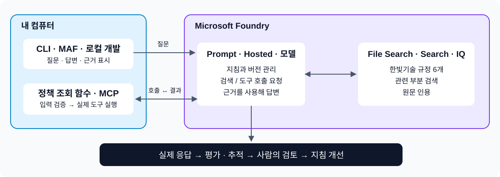

# Microsoft Foundry Hands-on Labs v1.5

## 출장 도우미 하나로 배우는 7시간

**“말을 잘하는 AI”를 “근거를 보여 주고, 도구로 계산하고, 품질을 확인할 수 있는 업무용 AI”로 바꿉니다.**

Foundry를 처음 접하는 분을 위한 한국어 실습입니다. 메뉴를 많이 구경하는 대신, **가상 기업 다온테크의 출장 준비 도우미 하나**를 끝까지 만듭니다. 처음에는 브라우저로 시작하고, 이후에는 제공된 Python 명령을 복사해 실행합니다. Python을 직접 작성할 필요는 없습니다.

**v1.5는 이 실습 가이드의 개정 번호입니다.** Microsoft Foundry 제품 버전이나 Python SDK 버전을 뜻하지 않습니다.

> **여기서 시작:** 수업 전 [준비 가이드](docs/00-setup.md) → 수업 시작 [Lab 01](docs/01-foundry.md).
>
> 이미 준비했다면 README를 끝까지 읽지 말고 Lab 01을 여세요. 각 실습 끝의 **다음 실습**만 따라가면 됩니다.

## 오늘 만들 것

사용자: **“2026년 9월 서울 2박 3일 출장의 숙박비와 식비 상한을 계산해 줘.”**

완성한 도우미의 기대 결과:

```text
합산 상한은 390,000원입니다.
- 숙박비: 150,000원 × 2박 = 300,000원
- 식비: 30,000원 × 3일 = 90,000원
- 근거: TRAVEL-2026, 2026-07-01부터 적용 [실제 파일 인용]

교통비는 제외한 지원 상한 추정치입니다.
출장 전 팀장 승인이 필요하며, 제가 승인하거나 결제한 것은 아닙니다.
```

**위 문장은 목표 예시이지 미리 생성한 실행 결과가 아닙니다.** 실제 파일 인용, 계산 도구 호출 기록, 본인의 응답 ID까지 확인해야 완성입니다. “도쿄 규정은?”에는 모른다고 답하고, “지금 승인해 줘”에는 실행할 수 없다고 설명해야 합니다.



그림을 한 줄로 읽으면: **앱에서 질문 → Foundry 에이전트가 문서 검색 → 필요하면 앱의 계산 함수 호출 → 근거와 답변 → 평가·추적으로 개선**입니다.

## Foundry는 무엇이고, 왜 배우나요?

**Microsoft Foundry는 AI 모델을 업무에 쓰는 에이전트로 만들고, 평가하고, 운영하는 Azure 플랫폼입니다.** 모델 하나의 이름도, 채팅 화면 하나의 이름도 아닙니다.

| 업무에서 생기는 문제 | 모델 호출만으로 부족한 점 | 이 실습에서 경험할 것 |
|---|---|---|
| “우리 규정에 맞는 답인가?” | 모델은 제공하지 않은 사내 규정을 모름 | 문서 검색과 인용 |
| “계산을 정말 했나?” | 그럴듯한 숫자와 실행 결과는 다름 | 입력을 검증하는 계산 도구 |
| “바꾸고 나서 더 좋아졌나?” | 좋은 답변 한 건으로는 판단하기 어려움 | 같은 질문으로 전후 평가 |
| “무슨 일이 일어났나?” | 최종 문장만으로 원인을 찾기 어려움 | 응답 ID, 도구 기록, Foundry trace |
| “회사에서 누가 관리하나?” | 코드 외에도 권한·비용·데이터 책임이 필요 | 프로젝트, 역할, 비용, 자원 정리 |

**핵심은 모델을 더 똑똑하게 보이게 하는 것이 아니라, 답변을 신뢰할 수 있는 조건을 만드는 것입니다.**

## 딱 한 경로, 총 420분

**실습·설명 390분 + 휴식 30분 = 7시간.** 설치, 권한 승인, 리소스 준비, 점심은 포함하지 않습니다. 준비 완료 상태를 전제로 한 수업 설계 시간이며, 초보자 시범 수업에서 실측한 완료 시간은 아닙니다.

| 순서 | 시간 | 직접 하는 일 | 남는 결과 |
|---|---:|---|---|
| [01. Foundry 이해와 첫 성공](docs/01-foundry.md) | 35분 | 프로젝트와 모델을 찾고 첫 질문 | Foundry를 설명하는 한 문장 |
| [02. 모델과 프롬프트](docs/02-models-prompts.md) | 45분 | 같은 모델에 서로 다른 지침 실험 | 전후 답변, 모델의 지식 한계 |
| 휴식 | 10분 | | |
| [03. 문서에 근거하는 에이전트](docs/03-knowledge.md) | 70분 | 규정 3개로 실제 File Search 연결 | 근거·날짜를 확인한 답변 |
| [04. 정확하게 계산하는 도구](docs/04-tools.md) | 65분 | 계산 함수 연결, 정상·오류·권한 경계 체험 | 실제 함수 입력과 계산 결과 |
| 휴식 | 10분 | | |
| [05. 평가하고 개선하기](docs/05-evaluation.md) | 65분 | 6문항 평가 → 지침 수정 → 같은 6문항 재평가 | 전후 검토표와 선택 버전 |
| [06. 앱과 Foundry 운영 화면](docs/06-app-operations.md) | 55분 | 브라우저 앱, 포털 평가, trace, 비용 확인 | 사용 가능한 로컬 앱과 운영 기록 |
| 휴식 | 10분 | | |
| [07. 최종 시연과 정리](docs/07-capstone.md) | 55분 | 새 4문항, 짝 시연, 자원 정리 | 결과물과 업무 적용 카드 |
| **합계** | **420분** | | |

예를 들어 09:00에 시작해 점심을 별도로 1시간 가지면 17:00에 끝납니다. 강사용 진행 시각은 [강사 가이드](docs/instructor.md)에 있습니다.

## 성공을 만드는 세 가지 규칙

1. **작게 시작합니다.** 프로젝트 1개, 모델 배포 1개, 에이전트 이름 1개, 규정 문서 3개를 사용합니다. 에이전트는 같은 이름 아래 새 버전으로 발전합니다.
2. **실행과 주장을 구분합니다.** “도구를 썼다”는 문장 대신 실제 `function_call`과 반환값을 봅니다. 파일을 지침에 붙여 넣은 것을 RAG라고 부르지 않습니다.
3. **잘못된 답도 남깁니다.** 오류·오답을 예시 답변으로 바꾸지 않습니다. 개선이 없으면 없다고 기록합니다.

## 7시간 기본 동선과 v1.2 기능의 관계

**직접 경험:** 현재 Foundry 포털, 모델 배포 이름, Prompt Agent 버전, 관리형 File Search, 함수 호출, 업무 평가, 포털의 기존 응답 평가, 서버 측 trace, 로컬 웹 앱, 권한·비용·정리.

**v1.2의 기능을 삭제하지 않았습니다.** 모델 비교·Router, MAF·MCP·워크플로, Search·Foundry IQ·Toolbox, Hosted, 고급 평가·Optimizer·Memory·Routines·A2A·운영/거버넌스는 [기능별 실습 카드](docs/features/README.md)와 **고정한 v1.2 실행 코드**로 유지합니다. [전체 기능 대응표](docs/feature-map.md)에서 빠짐없이 찾을 수 있습니다.

7시간은 처음 배우는 분의 **기본 완주 동선**입니다. 전체 고급 기능을 7시간에 모두 깊게 실습했다고 주장하지 않습니다. 상세 실습은 기본 Lab에서 해당 개념을 이해한 뒤 이어지며, 추가 준비·시간·비용을 각 카드에 명시합니다. **기능 범위는 유지하고, 처음부터 고를 메뉴와 동시에 해결할 문제를 줄인 것이 v1.5의 변화입니다.**

앱은 **내 컴퓨터의 `127.0.0.1`에서만 실행**합니다. 에이전트 정의와 모델·파일 검색은 Foundry에 있지만, 계산 함수와 앱은 로컬에 있습니다. 이를 “앱의 Azure 운영 배포를 완료했다”고 표현하지 않습니다.

## 필요한 자료는 모두 이 폴더에 있습니다

```text
README.md                  출발점과 전체 시간표
docs/00-setup.md            수업 전 준비
docs/01-... ~ 07-...        순서대로 따라가는 실습 7개
docs/instructor.md         사전 점검과 시간 운영
docs/troubleshooting.md    막혔을 때
worksheets/workbook.md     개인 결과와 업무 적용 기록
data/knowledge/            직접 업로드할 가상 규정 3개
data/evaluation/           연습 6문항 / 최종 4문항
prompts/                   시작 지침과 개선 지침
lab.py                     복사해 실행하는 실습 명령
app.py                     완성할 브라우저 앱
workshop.py / tools.py      SDK 연결과 읽기 전용 계산 함수
evaluation.py              실제 응답 수집과 사람 검토표 처리
docs/features/             v1.2 기능을 더 짧게 따라가는 상세 실습 카드
scripts/v12.py             고정한 v1.2 기능 실행 진입점
.reference/v1.2/            별도로 준비되는 원본 기능 코드·데이터·SDK
```

실행하면 `.lab/`에는 자원 ID와 선택 버전, `outputs/`에는 실제 답변과 평가표가 생깁니다. `.env`, `.lab/`, `outputs/`는 공유하거나 Git에 올리지 않습니다. 워크북은 **개인 사본**을 만들어 사용하세요.

## 기준과 참고

현재 Foundry의 **Projects SDK 2.x + Responses API**를 사용합니다. Classic의 Assistants/Threads/Runs 예제를 섞지 않습니다. 기본 모델 예시는 빠른 입문 실습에 적합한 `gpt-4.1-mini`이며, 코드에서는 모델명이 아닌 **배포 이름 `workshop-chat`**을 사용합니다. 실제 가용 리전·할당량·File Search 지원은 수업 전에 점검해야 합니다.

[v1.0](https://github.com/junwoojeong100/microsoft-foundry-labs)은 **Ignite 2025 직후**, [v1.2](https://github.com/junwoojeong100/microsoft-foundry-v1.2-labs)는 **현재 추가된 기능을 반영한 판**입니다. **v1.5는 v1.2 기능을 유지하면서 학습 경험을 개선하는 판**이고, **v2.0은 Ignite 2026 이후 제작 예정**입니다. 향후 발표 기능을 미리 가정하지 않습니다.

기본 경로의 문서·데이터·예제는 새로 작성했고, 상세 기능의 실행 구현은 고정한 v1.2 소스를 재사용합니다. 원본의 실행 결과를 v1.5의 결과로 가져오지 않았습니다. 확인일은 **2026-09-27**입니다.

버전별 제작 맥락·기능 유지·안내 개선 사항은 [v1.5 변경 지도](v1.5-changes.md)에 정리했습니다.

**[출처와 검증 범위](docs/sources.md)** · **[문제 해결](docs/troubleshooting.md)** · **[개인 워크북](worksheets/workbook.md)**
