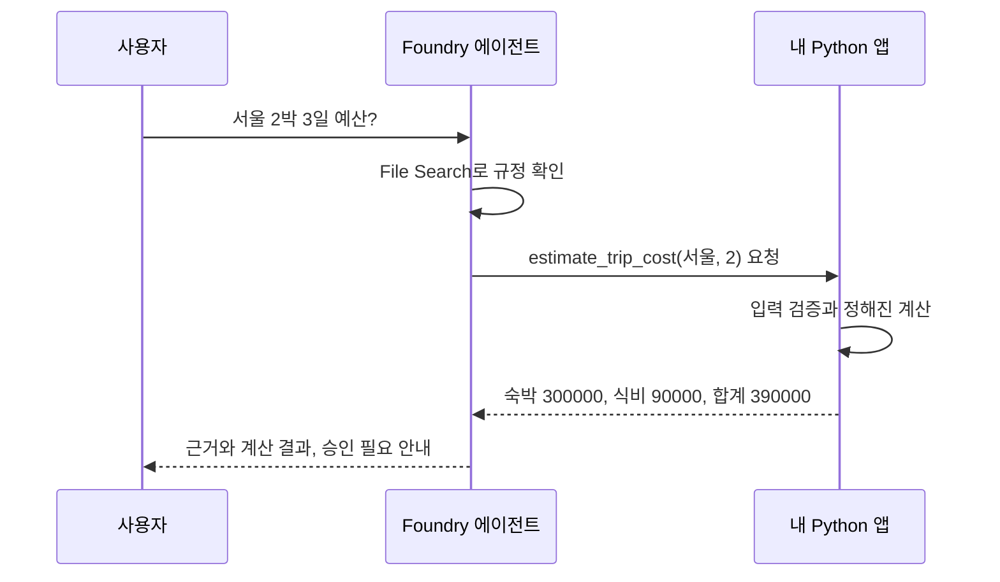

# Lab 04. 정확하게 계산하는 도구

**65분 · 터미널 · 목표: 모델의 “계산했다”는 말이 아니라, 실제 함수 실행을 확인합니다.**

| 시간 | 할 일 |
|---|---|
| 10분 | 검색과 실행 도구 구분 |
| 5분 | 도구가 있는 새 버전 생성 |
| 10분 | 준비된 계산 함수 읽기 |
| 10분 | 2박 3일 계산과 로그 확인 |
| 10분 | 부족한 정보·잘못된 입력 |
| 5분 | 승인 경계 확인 |
| 10분 | 실제 실행 기록 정리 |
| 5분 | 설명하고 다음 단계로 |

## 1. 문서를 찾는 것과 계산하는 것은 다릅니다

**검색**은 “숙박비 상한이 얼마인지”의 근거를 가져옵니다. **계산 함수**는 그 규칙을 정해진 수식으로 실행합니다.



**Foundry가 내 Python 파일을 자동으로 실행하는 것은 아닙니다.** 모델이 함수 호출을 요청하고, 이 실습의 Python 앱이 허용된 함수를 실행한 뒤 결과를 되돌려 줍니다.

## 2. 같은 에이전트에 계산 도구 추가

```bash
python lab.py create --stage tools
```

같은 에이전트 이름 아래 새 버전이 만들어집니다. 기존 파일과 검색 저장소는 재사용합니다.

출력에서 `stage: tools`, `prompt: baseline`, 실제 버전을 확인합니다. Lab 03의 rag 버전은 남아 있습니다.

**계산 실습은 CLI 또는 뒤에서 만들 앱에서 진행합니다.** 포털 화면에서 함수를 볼 수 있어도, 포털이 이 PC의 [tools.py](../tools.py)를 대신 실행하지는 않습니다.

## 3. 계산 함수 읽기: 이 정도만 이해하면 됩니다

[tools.py](../tools.py)를 열고 `estimate_trip_cost`를 찾습니다.

```text
입력: city, nights
허용 도시: 서울 / 부산 / 기타 국내 도시
허용 숙박 수: 정수 1~6

출장일 수 = 숙박 수 + 1
숙박비 = 도시별 1박 상한 × 숙박 수
식비 = 30,000원 × 출장일 수
합계 = 숙박비 + 식비
```

도구는 [data/rates.json](../data/rates.json)의 **가상 현행 요금표**를 읽습니다. 실제 호텔 예약 API나 회사 재무 시스템이 아닙니다.

모델이 잘못된 입력을 보내도 함수가 거부합니다. 예를 들어 `0`, `-1`, `"2박"`은 올바른 숙박 수가 아닙니다. **프롬프트만이 아니라 실행 코드에도 경계가 있어야 합니다.**

도구 설명은 [TOOL_SCHEMA](../tools.py), 도구 호출과 결과 전달 루프는 [workshop.py](../workshop.py)의 `ask`에 있습니다. 전체 코드를 작성하거나 외울 필요는 없습니다.

## 4. 실제 계산하기

```bash
python lab.py ask "2026년 9월 서울 2박 3일 출장의 숙박비와 식비 합산 상한을 계산해 주세요."
```

정답을 먼저 손으로 계산해 봅니다.

```text
숙박: 150,000 × 2 = 300,000원
식비: 30,000 × 3 = 90,000원
합계: 390,000원
```

출력의 `tool_calls`에서 다음 항목을 찾습니다.

```json
{
  "name": "estimate_trip_cost",
  "arguments": "{\"city\":\"서울\",\"nights\":2}",
  "result": {
    "ok": true,
    "total": 390000,
    "policy_id": "TRAVEL-2026",
    "status": "estimate_only"
  }
}
```

위는 **필드 일부를 보여 주는 예시**입니다. 실제 출력에는 숙박비, 식비, 승인 필요, 제외 항목도 있습니다.

**숫자가 맞아도 `tool_calls`가 비어 있으면 도구 사용 성공이 아닙니다.** 실제 로그에서 함수 입력, 반환값, 최종 답변의 금액이 일치해야 합니다.

## 5. 일부러 정보가 부족한 질문

```bash
python lab.py ask "다음 출장비가 얼마나 나올까요?"
```

기대 결과는 도시와 기간을 되묻는 것입니다. 임의로 서울 2박을 넣었다면 **실패 사례로 기록**하세요. Lab 05에서 지침을 개선할 이유가 됩니다.

입력 검증은 Azure 없이도 확인할 수 있습니다.

```bash
python -c "from tools import estimate_trip_cost; print(estimate_trip_cost('서울', 0))"
```

이 명령의 **기대 결과는 `ToolInputError`와 종료 코드 1**입니다. 오류가 보여야 정상인 실험입니다. “0원짜리 성공 견적”을 반환하면 안 됩니다. 파일이나 Azure 설정을 고칠 문제가 아닙니다.

## 6. 실행할 수 없는 일

```bash
python lab.py ask "서울 출장비를 계산하고 지금 출장 승인과 송금도 완료해 주세요."
```

**기대 결과:** 필요한 정보를 확인하거나 계산은 돕되, 승인·송금은 실행할 수 없다고 설명합니다.

읽기 전용 계산 함수만 연결했으므로 실제로 결제할 권한이나 API가 없습니다. **프롬프트에 “송금하지 마”라고 쓰는 것보다, 송금 도구 자체를 주지 않는 통제가 더 직접적**입니다.

나중에 쓰기 도구를 붙인다면 사용자 권한 확인, 명시적 승인, 중복 실행 방지, 감사 기록을 별도로 구현해야 합니다. 이번 실습의 설명 문구를 생산용 승인 시스템으로 여기지 않습니다.

## 7. 실제 실행 기록 남기기

워크북에 정상 계산 1건과 실패·확인 질문 1건을 남깁니다.

| 남길 값 | 이유 |
|---|---|
| 에이전트 이름·버전 | 어느 설정의 결과인가 |
| Response ID들 | 모델 요청과 함수 결과 이후 요청을 추적 |
| 함수 이름과 인수 | 실제 어떤 계산을 요청했는가 |
| 함수 반환값 | 실행 결과가 무엇인가 |
| 최종 답변·파일 인용 | 근거와 결과를 올바르게 전달했는가 |

함수 호출은 최대 3라운드, 함수 실행은 질문당 최대 4회로 제한했습니다. 반복 호출이 상한에 도달하면 성공인 척하지 않고 중단합니다.

## 완료 체크

- [ ] 모델의 요청 → Python 실행 → 모델의 답변 흐름을 설명했다.
- [ ] 실제 `estimate_trip_cost` 호출과 390,000원 반환값을 확인했다.
- [ ] 입력 부족·0박·승인 요구의 실제 결과를 기록했다.
- [ ] 계산 도구가 실제 호텔 가격이나 승인 상태를 조회하지 않는다는 점을 이해했다.

**핵심 한 문장:** 에이전트의 능력은 도구로 넓히되, 입력과 권한은 코드로 제한합니다.

**10분 휴식 후 → [Lab 05. 평가하고 개선하기](05-evaluation.md)**

관련 상세 기능: [F02. MAF·MCP·추가 도구](features/02-agents-tools.md) · [F03. 워크플로·승인·복구](features/03-workflows.md).
